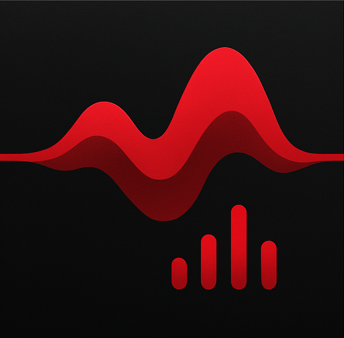

<div align="center">



# 🎵 Noir Player

**A sleek, lightweight Flutter music player** — play your local library, discover trending tracks, and download songs straight to your device.

<p>
  <a href="https://flutter.dev"></a>
  <a href="https://dart.dev"></a>
  
  <a href="LICENSE"></a>
  
  
</p>

</div>

---

## 📖 Table of Contents

- [📦 Overview](#-overview)
- [✨ Features](#-features)
- [🖼️ Screens](#️-screens)
- [📁 Project Structure](#-project-structure)
- [🚀 Getting Started](#-getting-started)
  - [Prerequisites](#prerequisites)
  - [Installation](#installation)
  - [🔑 Environment Setup (API Keys)](#-environment-setup-api-keys)
  - [Running the App](#running-the-app)
- [🧭 How It Works](#-how-it-works)
- [🛠️ Architecture](#️-architecture)
- [📦 Dependencies](#-dependencies)
- [🤝 Contributing](#-contributing)
- [📄 License](#-license)

---

## 📦 Overview

Noir Player is a small, focused Flutter app that:

1. **Loads your local audio files** from the device library.
2. **Shows them in a tabbed library** (`Songs`, `Albums`, `Artists`, `Playlists`).
3. **Runs a background audio service**, so playback keeps going when the app is backgrounded or the screen is locked.
4. **Discovers new music** — browse trending tracks and search by name via the **Last.fm** API.
5. **Streams & downloads** — preview tracks and save them as MP3 to your device's music folder.

---

## ✨ Features

| Feature | Where | How it works |
|---|---|---|
| 🎼 **Tabbed Library** | `library_screen.dart` | Songs / Albums / Artists / Playlists via `on_audio_query` |
| ▶️ **Now Playing** | `player_screen.dart` | Reactive UI bound to `audioHandler.mediaItem` & `playbackState` |
| 🔊 **Background Playback** | `audio_handler.dart` | `audio_service` + `just_audio` keep music playing in the background |
| 🧭 **Discover** | `discover_screen.dart` | Trending + search powered by Last.fm, with album art |
| ⬇️ **Download** | `music_discovery_service.dart` | Resolves YouTube → MP3 (RapidAPI) and saves via `media_store_plus` |
| 🎨 **Theming** | `settings_screen.dart` | Light / Dark / System theme, switchable at runtime |

---

## 🖼️ Screens

The app uses a **bottom navigation bar** with five destinations:

| Tab | Description |
|---|---|
| 📚 **Library** | Your local songs, albums, artists |
| 🎵 **Player** | The full "Now Playing" view |
| 🎶 **Playlists** | Create and browse playlists |
| 🧭 **Discover** | Trending tracks, search, stream & download |
| ⚙️ **Settings** | Theme selection and app preferences |

---

## 📁 Project Structure

```
lib/
├── main.dart                      # App entry — loads .env, inits audio service
├── core/
│   ├── models/
│   │   ├── playlist_model.dart
│   │   └── discovered_track.dart  # Discover/download track model
│   ├── services/
│   │   ├── audio_handler.dart     # Background audio (audio_service + just_audio)
│   │   └── music_discovery_service.dart  # Last.fm + YouTube + MP3 download
│   └── theme/
│       └── app_theme.dart
├── screens/
│   ├── home/home_screen.dart      # Bottom nav shell
│   ├── library/                   # Library + tabs (songs/albums/artists/playlists)
│   ├── player/player_screen.dart
│   ├── playlists/
│   ├── albums/  artist/
│   ├── discover/discover_screen.dart   # 🆕 Discover + download UI
│   └── settings/settings_screen.dart
└── widgets/
```

---

## 🚀 Getting Started

### Prerequisites

| Requirement | Version |
|---|---|
| Flutter SDK | ≥ 3.9 |
| Dart SDK | ≥ 3.9 |
| Android | 6.0 (API 23)+ |

```bash
flutter --version
```

### Installation

```bash
git clone https://github.com/Abdullah-Masood-05/NoirPlayer.git
cd NoirPlayer
flutter pub get
```

### 🔑 Environment Setup (API Keys)

The **Discover / download** module needs API keys. They are loaded at runtime from a
`.env` file (via [`flutter_dotenv`](https://pub.dev/packages/flutter_dotenv)) and are
**never committed** — `.env` is in `.gitignore`.

1. Copy the template:

   ```bash
   cp .env.example .env
   ```

2. Fill in your keys in `.env`:

   ```dotenv
   LASTFM_API_KEY=your_lastfm_key
   YOUTUBE_API_KEY=your_youtube_data_api_v3_key
   RAPIDAPI_KEY=your_rapidapi_key
   ```

   | Key | Get it from |
   |---|---|
   | `LASTFM_API_KEY` | https://www.last.fm/api/account/create |
   | `YOUTUBE_API_KEY` | https://console.cloud.google.com/apis/credentials |
   | `RAPIDAPI_KEY` | https://rapidapi.com/ (subscribe to the **youtube-mp36** API) |

> 💡 Without keys, the rest of the app (local library + playback) still works — only the Discover tab needs them.

### Running the App

```bash
flutter run -d android
```

> On first launch the app requests permission to read your music library and to download files. Grant them and the library populates automatically.

---

## 🧭 How It Works

```
┌─────────────────────┐     init      ┌──────────────────────┐
│   main.dart          │ ───────────▶ │  AudioHandler        │
│ (loads .env + audio) │              │ (audio_service)      │
└──────────┬──────────┘              └──────────────────────┘
           │
           ▼
┌─────────────────────┐   bottom nav   ┌──────────────────────┐
│   HomeScreen         │ ─────────────▶ │ Library / Player /   │
│ (5-tab shell)        │                │ Playlists / Discover │
└─────────────────────┘                └──────────┬───────────┘
                                                   │ Discover
                                                   ▼
                                    ┌──────────────────────────────┐
                                    │ MusicDiscoveryService         │
                                    │ Last.fm → YouTube → MP3 → save │
                                    └──────────────────────────────┘
```

**Download flow:** pick a track → look up its YouTube video ID → resolve an MP3 URL
(RapidAPI) → stream-download with `dio` (with progress) → save to the device's Music
folder via `media_store_plus`.

---

## 🛠️ Architecture

| File | Responsibility |
|---|---|
| `main.dart` | Loads `.env`, initialises the audio service, sets up theming & routes |
| `audio_handler.dart` | Wraps `audio_service` + `just_audio` for background playback and notifications |
| `library_screen.dart` | Tabbed local library using `on_audio_query` |
| `discover_screen.dart` | Discover UI — search, trending, preview-play, and per-track download progress |
| `music_discovery_service.dart` | Last.fm metadata, YouTube lookup, RapidAPI MP3 resolution, and file saving |
| `player_screen.dart` | Reactive "Now Playing" bound to the audio service streams |

---

## 📦 Dependencies

| Package | Purpose |
|---|---|
| [`just_audio`](https://pub.dev/packages/just_audio) | Audio playback |
| [`audio_service`](https://pub.dev/packages/audio_service) | Background playback + notifications |
| [`on_audio_query`](https://pub.dev/packages/on_audio_query) | Read the device's music library & artwork |
| [`permission_handler`](https://pub.dev/packages/permission_handler) | Runtime permissions |
| [`provider`](https://pub.dev/packages/provider) · [`shared_preferences`](https://pub.dev/packages/shared_preferences) | State & persistence |
| [`http`](https://pub.dev/packages/http) · [`dio`](https://pub.dev/packages/dio) | Networking & file download |
| [`media_store_plus`](https://pub.dev/packages/media_store_plus) · [`path_provider`](https://pub.dev/packages/path_provider) | Saving downloads to device storage |
| [`flutter_dotenv`](https://pub.dev/packages/flutter_dotenv) | Loading API keys from `.env` |

> Run `flutter pub get` to install everything declared in `pubspec.yaml`.

---

## 🤝 Contributing

Pull requests are welcome! For major changes, please open an issue first to discuss what
you'd like to change.

1. Fork the repo
2. Create a feature branch (`git checkout -b feature/amazing-thing`)
3. Commit your changes
4. Open a PR 🎉

---

## 📄 License

Distributed under the **MIT License**. See [LICENSE](LICENSE) for details.

---

<div align="center">

**🎧 Enjoy the music with Noir Player!**

</div>
