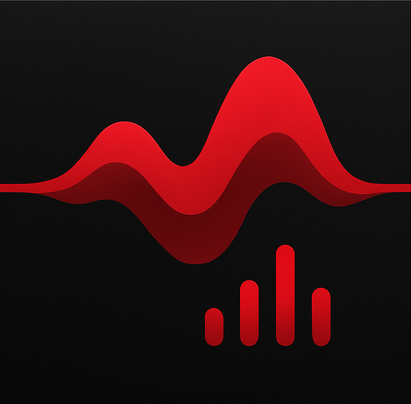

<div align="center">



# 🎵 Noir Player

**A sleek, lightweight Flutter music player** — play your local library, discover trending tracks, and download songs straight to your device.

<p>
  <a href="https://github.com/Abdullah-Masood-05/NoirPlayer/releases/latest"></a>
  <a href="https://github.com/Abdullah-Masood-05/NoirPlayer/releases/latest"></a>
  <a href="https://flutter.dev"></a>
  <a href="https://dart.dev"></a>
  
  <a href="LICENSE"></a>
  <a href="https://github.com/Abdullah-Masood-05/noir-player-desktop-app"></a>
</p>

<p>
  <a href="https://github.com/Abdullah-Masood-05/NoirPlayer/releases/latest"><b>📥 Download for Android or iPhone</b></a>
  &nbsp;·&nbsp;
  <a href="https://github.com/Abdullah-Masood-05/noir-player-desktop-app/releases/latest"><b>🖥️ Get it for desktop</b></a>
</p>

</div>

---

## 📖 Table of Contents

- [📦 Overview](#-overview)
- [✨ Features](#-features)
- [📥 Download](#-download)
  - [Updating from 1.1.x](#updating-from-11x)
- [🖥️ Noir Player for Desktop](#️-noir-player-for-desktop)
- [🖼️ Screens](#️-screens)
- [📁 Project Structure](#-project-structure)
- [🚀 Getting Started](#-getting-started)
  - [Prerequisites](#prerequisites)
  - [Installation](#installation)
  - [🔑 Discover Setup](#-discover-setup)
  - [Running the App](#running-the-app)
- [🏗️ Building / CI](#️-building--ci)
- [🧭 How It Works](#-how-it-works)
- [🛠️ Architecture](#️-architecture)
- [📦 Dependencies](#-dependencies)
- [🤝 Contributing](#-contributing)
- [📄 License](#-license)

---

## 📦 Overview

Noir Player is a small, focused Flutter app that:

1. **Loads your local audio files** from the device library.
2. **Shows them in a tabbed library** (`Music`, `Audio`, `Albums`, `Artists`), with playlists one tap away.
3. **Runs a background audio service**, so playback keeps going when the app is backgrounded or the screen is locked — with the song's title, artist and cover art on the standard media notification, which the lock screen, the Samsung Now Bar and other system media controls pick up.
4. **Discovers new music** — browse trending tracks and search by name through **Noir Player's server**, the same one the desktop app uses. You can add your own Last.fm, YouTube or RapidAPI keys in **Settings → Discover** if you like.
5. **Streams & downloads** — preview tracks and save them as MP3 to your device's music folder.
6. **Tailors playback** — skip back / forward by your own seek interval, sleep timer, playback speed, resume‑after‑a‑call and more, all in a sectioned Settings page reached from the side drawer.

> 🖥️ **On a computer?** [Noir Player for Desktop](https://github.com/Abdullah-Masood-05/noir-player-desktop-app) is the same player rebuilt in Rust for Windows, macOS and Linux.

---

## ✨ Features

| Feature | Where | How it works |
|---|---|---|
| 🎼 **Tabbed Library** | `library_screen.dart` | Music / Audio / Albums / Artists via `on_audio_query` |
| ▶️ **Now Playing** | `player_screen.dart` | Reactive UI bound to `audioHandler.mediaItem` & `playbackState` |
| 🔊 **Background Playback** | `audio_handler.dart` | `audio_service` + `just_audio` with a standard media notification (title, artist, cover art) that the lock screen, Samsung Now Bar and other system media controls show |
| 🧭 **Discover** | `discover_screen.dart` | Trending + search with album art, through Noir Player's server or your own keys |
| ⬇️ **Download** | `music_discovery_service.dart` | Resolves YouTube → MP3 and saves straight into your Music folder, with duplicate‑download protection |
| 🎚️ **Equalizer** | `equalizer_screen.dart` | Native equalizer bands and presets |
| ⏱️ **Sleep Timer** | `sleep_timer_service.dart` | Auto‑pause after a chosen duration, with a live countdown |
| ⏪ **Skip Back / Forward** | `player_screen.dart` | Back / forward buttons that jump by your seek interval (5–60 s or a custom 1–300 s, set in Settings → Playback), also used by the notification, lock screen and headset |
| ⏩ **Playback Speed** | `audio_handler.dart` | 0.5×–2× without pitch change, persisted |
| 📞 **Call / interruption handling** | `audio_handler.dart` | Resume after a call via `audio_session` |
| ⚙️ **Persistent Settings** | `settings_service.dart` | Theme, playback, notification and Discover‑key options saved with `shared_preferences` |

---

## 📥 Download

Every release on the **[Releases](https://github.com/Abdullah-Masood-05/NoirPlayer/releases/latest)** page has
an Android APK and an iOS build, plus a `SHA256SUMS` file to check your download against.

**Android** — download `NoirPlayer-vX.Y.Z.apk` on your phone (Android 7.0 or newer), open it and tap
**Install**. If Android asks, allow your browser or file manager to install unknown apps.

**iPhone / iPad** — download `NoirPlayer-iOS-vX.Y.Z-unsigned.ipa` and sideload it with a tool such as
**Sideloadly** or **AltStore**, which signs it with your own Apple ID. It is built on GitHub Actions; see the
[iOS build guide](docs/iOS_BUILD_GUIDE.md).

### Updating from 1.1.x

Version 1.2.0 is signed with a new, permanent release key, so Android won't install it over an earlier
version. Uninstall the old Noir Player first, then install 1.2.1. Playlists and settings stored on the
device aren't carried over. From 1.2.0 on, updates install in place: 1.2.1 installs straight over 1.2.0.

| Version | Notes |
|---|---|
| **v1.2.1** | Skip back / forward buttons on the player, a seek interval of your choice in Settings → Playback, the real version in About, one‑time notification permission for pop‑up players |
| v1.2.0 | Discover through Noir Player's server, your own keys in Settings → Discover, cleaner now‑playing info on system media controls, unsigned iOS IPA |
| v1.1.3 | Instant Library tab switching, Back returns to Library |
| v1.1.2 | Reliable downloads into your Music folder, choose the download folder |
| v1.1.1 | Native equalizer (bands + presets) |
| v1.1.0 | Music‑folder tab, repeat/shuffle, Discover plays in the main player, playlist/favourites fixes, immersive UI + animations |
| v1.0.0 | Online discovery, downloads, media controls and full playback settings |
| v0.2.0 | Firebase authentication (experimental, pre‑release) |
| v0.1.0 | Initial local music player |

---

## 🖥️ Noir Player for Desktop

Noir Player started here, on Android. The **[desktop edition](https://github.com/Abdullah-Masood-05/noir-player-desktop-app)** carries the
same idea to the computer: a local library, the red‑on‑black look, and Discover — rebuilt
from scratch in **Rust** with **GPUI Kit** rather than Flutter.

| | 📱 Mobile (this repo) | 🖥️ [Desktop](https://github.com/Abdullah-Masood-05/noir-player-desktop-app) |
|---|---|---|
| **Built with** | Flutter · Dart | Rust · GPUI Kit |
| **Runs on** | Android · iOS (unsigned IPA) | Windows · macOS · Linux |
| **Library** | Device audio via `on_audio_query` | Folder scanning, sorted A→Z under letter headings |
| **Playback** | Background service, notification, lock‑screen & Now Bar controls | Desktop transport bar, click‑to‑seek, queue rail |
| **Extras** | Sleep timer, playback speed | 5‑band equalizer, embedded lyrics, in‑app updates |
| **Discover** | Last.fm search, YouTube → MP3 download, through Noir Player's server | The same services, through the same server |

<p>
  <a href="https://github.com/Abdullah-Masood-05/noir-player-desktop-app/releases/latest"><b>📥 Download for Windows, macOS or Linux</b></a>
</p>

---

## 🖼️ Screens

A **4‑tab bottom bar** plus a **hamburger drawer** for everything else:

| Destination | Where | Description |
|---|---|---|
| 📚 **Library** | bottom bar | Your local songs, albums, artists |
| 🎵 **Player** | bottom bar | The full "Now Playing" view (with speed & sleep‑timer actions) |
| 🎶 **Playlists** | bottom bar | Create and browse playlists |
| 🧭 **Discover** | bottom bar | Trending tracks, search, stream & download |
| ⚙️ **Settings** | drawer | Appearance, playback, notification, timer & Discover options |
| ⏱️ **Sleep Timer** | drawer | Start / cancel the auto‑stop timer |
| ℹ️ **About** | drawer | App info |

---

## 📁 Project Structure

```
lib/
├── main.dart                      # App entry — loads settings, inits audio service
├── core/
│   ├── models/
│   │   ├── playlist_model.dart
│   │   └── discovered_track.dart        # Discover/download track model
│   ├── services/
│   │   ├── audio_handler.dart           # Background audio, media controls, interruptions
│   │   ├── discover_api.dart            # Discover requests: Noir Player's server or your own keys
│   │   ├── music_discovery_service.dart # Last.fm + YouTube + MP3 download
│   │   ├── settings_service.dart        # Persisted user preferences
│   │   └── sleep_timer_service.dart     # Auto‑stop timer
│   └── theme/
│       └── app_theme.dart
├── screens/
│   ├── home/home_screen.dart      # Bottom nav + hamburger drawer shell
│   ├── library/                   # Library + tabs (songs/albums/artists/playlists)
│   ├── player/player_screen.dart
│   ├── playlists/
│   ├── albums/  artist/
│   ├── discover/discover_screen.dart    # Discover + download UI
│   ├── settings/settings_screen.dart    # Sectioned settings
│   └── about/about_screen.dart
└── widgets/
    └── playback_menus.dart        # Sleep‑timer & playback‑speed bottom sheets
```

---

## 🚀 Getting Started

### Prerequisites

| Requirement | Version |
|---|---|
| Flutter SDK | 3.35.7 (the version CI uses) |
| Dart SDK | 3.9 (bundled with Flutter) |
| Android | 7.0 (API 24)+ |

```bash
flutter --version
```

### Installation

```bash
git clone https://github.com/Abdullah-Masood-05/NoirPlayer.git
cd NoirPlayer
flutter pub get
```

### 🔑 Discover Setup

Discover works out of the box: trending tracks, search, YouTube lookups and MP3
resolution all run through **Noir Player's server** (`https://noir-player-api.vercel.app`),
the same one the desktop app uses. There is nothing to configure.

If you have API keys of your own, you can add them in **Settings → Discover**. Any service
you enter a key for is called directly with your key; the others keep going through
Noir Player's server. Keys are stored on your device only, and clearing a field switches
that service back to the server.

| Setting | Get a key from |
|---|---|
| Last.fm API key | https://www.last.fm/api/account/create |
| YouTube Data API key | https://console.cloud.google.com/apis/credentials (YouTube Data API v3) |
| RapidAPI key | https://rapidapi.com/ (subscribe to the **youtube-mp36** API) |

> 💡 The rest of the app (local library + playback) works offline; only the Discover tab needs a connection.

### Running the App

```bash
flutter run -d android
```

> On first launch the app requests permission to read your music library and to download files. Grant them and the library populates automatically.

---

## 🏗️ Building / CI

GitHub Actions does the building, with **Flutter 3.35.7**:

- **Every push** runs `ci.yml` (`flutter analyze`, `flutter test`, then a release APK) and `ios.yml`
  (an unsigned IPA on a macOS runner). Both builds are kept as workflow artifacts for 30 days.
- **Releases** publish what CI already built. Pushing a tag `vX.Y.Z` that matches the `version:` in
  `pubspec.yaml` runs `release.yml`, which takes the APK and IPA from the green CI runs for the tagged
  commit, adds checksums and the notes from [`CHANGELOG.md`](CHANGELOG.md), and creates the GitHub
  release. Tag a commit once CI is green for it.
- **Release signing:** the APK is release‑signed when these repository secrets are set:
  `ANDROID_KEYSTORE_BASE64`, `ANDROID_KEYSTORE_PASSWORD`, `ANDROID_KEY_ALIAS` and
  `ANDROID_KEY_PASSWORD`. Without them CI signs with a debug key, and `release.yml` won't publish
  that APK.

To build locally, `flutter build apk --release` produces `build/app/outputs/flutter-apk/app-release.apk`.

---

## 🧭 How It Works

```
┌─────────────────────┐     init      ┌──────────────────────┐
│   main.dart          │ ───────────▶ │  AudioHandler        │
│ (settings + audio)   │              │ (audio_service)      │
└──────────┬──────────┘              └──────────────────────┘
           │
           ▼
┌─────────────────────┐   bottom nav   ┌──────────────────────┐
│   HomeScreen         │ ─────────────▶ │ Library / Player /   │
│ (5-tab shell)        │                │ Playlists / Discover │
└─────────────────────┘                └──────────┬───────────┘
                                                   │ Discover
                                                   ▼
                                    ┌──────────────────────────────┐
                                    │ MusicDiscoveryService         │
                                    │ Last.fm → YouTube → MP3 → save │
                                    └──────────────────────────────┘
```

**Download flow:** pick a track → look up its YouTube video ID → resolve an MP3 URL
(RapidAPI) → stream-download the MP3 straight from that link with `dio` (with progress) →
save to the device's Music folder. The lookup and resolve steps run through Noir Player's
server, or directly with your own key for any service you added one for in Settings.

---

## 🛠️ Architecture

| File | Responsibility |
|---|---|
| `main.dart` | Loads settings, initialises the audio service, sets up theming & routes |
| `audio_handler.dart` | Wraps `audio_service` + `just_audio` for background playback and notifications |
| `library_screen.dart` | Tabbed local library using `on_audio_query` |
| `discover_screen.dart` | Discover UI — search, trending, preview-play, and per-track download progress |
| `discover_api.dart` | Discover requests and response parsing — Noir Player's server, or each service directly with your own key |
| `music_discovery_service.dart` | Last.fm metadata, YouTube lookup, RapidAPI MP3 resolution, and file saving |
| `player_screen.dart` | Reactive "Now Playing" bound to the audio service streams |

---

## 📦 Dependencies

| Package | Purpose |
|---|---|
| [`just_audio`](https://pub.dev/packages/just_audio) | Audio playback (queue, speed, seeking) |
| [`audio_service`](https://pub.dev/packages/audio_service) | Background playback + notification / lock‑screen controls |
| [`audio_session`](https://pub.dev/packages/audio_session) | Audio focus & call/headset interruptions |
| [`on_audio_query`](https://pub.dev/packages/on_audio_query) | Read the device's music library & artwork |
| [`permission_handler`](https://pub.dev/packages/permission_handler) | Runtime permissions |
| [`provider`](https://pub.dev/packages/provider) · [`shared_preferences`](https://pub.dev/packages/shared_preferences) | State & persistence |
| [`http`](https://pub.dev/packages/http) · [`dio`](https://pub.dev/packages/dio) | Networking & file download |
| [`path_provider`](https://pub.dev/packages/path_provider) | Locating device folders for downloads |
| [`flutter_animate`](https://pub.dev/packages/flutter_animate) | UI animations |

> Run `flutter pub get` to install everything declared in `pubspec.yaml`.

---

## 🤝 Contributing

Pull requests are welcome! For major changes, please open an issue first to discuss what
you'd like to change.

1. Fork the repo
2. Create a feature branch (`git checkout -b feature/amazing-thing`)
3. Commit your changes
4. Open a PR 🎉

---

## 📄 License

Distributed under the **MIT License**. See [LICENSE](LICENSE) for details.

---

<div align="center">

**🎧 Enjoy the music with Noir Player!**

📱 Android · iOS · 🖥️ [Windows, macOS & Linux](https://github.com/Abdullah-Masood-05/noir-player-desktop-app)

</div>
